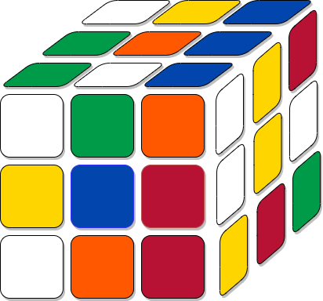

# Конечные группы и поля

> Work in Progress

Заметки по теории групп с решением задачи сбора кубика Рубика.

Код для запуска сбора кубика Рубика `src/rubik`. Для настройки можно обратиться к соответствующему [readme](src/rubik/README.md).
