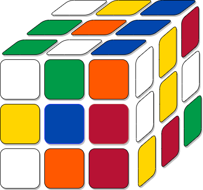

# Кубик Рубика

Во время вращений граней кубика его центральные клетки не двигаются, то есть переходят сами в себя. С помощью них мы будем кодировать все движения над кубиком и будем обозначать их буками:

- O - orange
- B - blue
- Y - yellow
- R - read
- G - green
- W - white

Условимся, что движение всегда происходит по часовой стрелке. Например, `B` означает поворот на 90 градусов грани в которой центральная клетка имеет синий цвет.

Слово, последовательность букв из списка выше, применяется к кубику Рубика как последовательность движений слева направо, то есть сперва будет применено то движение которое стоит справа. Например, слово `WBR` кодирует первое движение на грани _white_, второе на грани _blue_ и третье на грани _red_.
